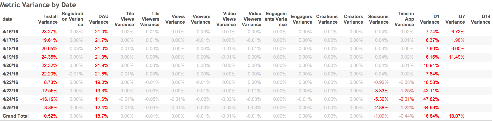

## Purpose: 

As the three vic tables are populated with the data provided by the new analytics backend micro service, it was necessary to examine the metrics calculated from the new data to ensure parity and examine and understand any discrepancies, should they appear. This page reviews the calculated comparisons day by day for all main Victorious metrics comparing those derived from the Data Cortex data and the new Analytics Microservice data from 4/16/2016 to 4/30/2016. 

**Note:** The new microservice will hold a certain number of events before pushing to the database until a user registered to appropriately map that user. If no registration event occurs after 4 days, the held data will push to the database. This is expected to have the biggest impact on installs, DAU, and session related events. The data for these events will likely be lower in the preceding 4 days than the current Data Cortex numbers. 

## Findings: 

The table below shows the metrics comparisons using the two services, using the Data Cortex numbers as the baseline. There is a significantly higher number of installs and DAU when calculating off the data from the new microservice than from the data from the existing Data Cortex service. The preceding 4 days (4/22 to 4/25) we see lower installs, session, and time in app numbers, with the latter two normalizing to the Data Cortex numbers after the 4 day period. Retention is also impacted, calculated as a measure of installs and dau. All other metrics have parity with Data Cortex.

### Installs Variance: 

Once the rolling 4 days have completed, there are around 20% to 22% higher installs using the new analytics microservice than with the Data Cortex data. After delving deeper in the causes for the higher install data, it appears that of that data is incorrect because of an bug that Data Cortex was using in their user mapping process where multiple devices and user map tags are assigned the same user ID. This accounts for about 72% of the additional installs numbers. 

Example of Data Cortex single user mapping for apparent multiple users: 

As a note, we only consider the first install from a user when calculating installs. For that reason, subsequent installs by the same user, even on a difference device, should not be counted towards a day's install count. However, since this new analytics microservice is a new service and does not have the history for lifetime installs, we cannot "dedupe" these subsequent installs if the first install occurred before this new analytics microservice began logging data. About 26% of the additional installs are driven by users whose initial installs were prior to the launch of the new microservice but are being counted as initial installs The impact of this will be mitigated over time with increased install rates from future services launching on the new microservice. 

DAU Variance: 

Multiple users with the same user mapping in the Data Cortex DAU data only accounts for 15% of increased DAU numbers. The main driver for the remaining increase in DAU using the new microservice is driven by a requirement in the Data Cortex DAU calculation for each DAU event to only be counted if there is a corresponding install event that occurred prior to the DAU event. About 20% of the additional users have an install event after their dau date. However, 3 out 4 of these users have these install dates are only a second after the dau date, and over 9 out of 10 of these users are within 10 seconds, suggesting that it is a matter of when the events were sent to database and are legitimate daily active users. 

Missing corresponding installs for a DAU user drives the remaining 65% of the increased DAU numbers. Given the installs analysis detailed above, we know that there should be about 15% more installs that are not present because of incorrect user mapping on the Data Cortex side. A complete analysis has not been completed to break down what amount of these users are missing installs because of incorrect Data Cortex user mapping versus other drivers but we suspect a majority of the remaining 65% is impacted by these incorrect user mappings. 

### Retention Variance: 

Retention is calculated as the users that are active within the apps on a N date over those their install cohort. Since the numerator is based on DAU and the denominator is based on Installs, and there is increased numbers on both, retention is increased for the dates. 

 

 

 

